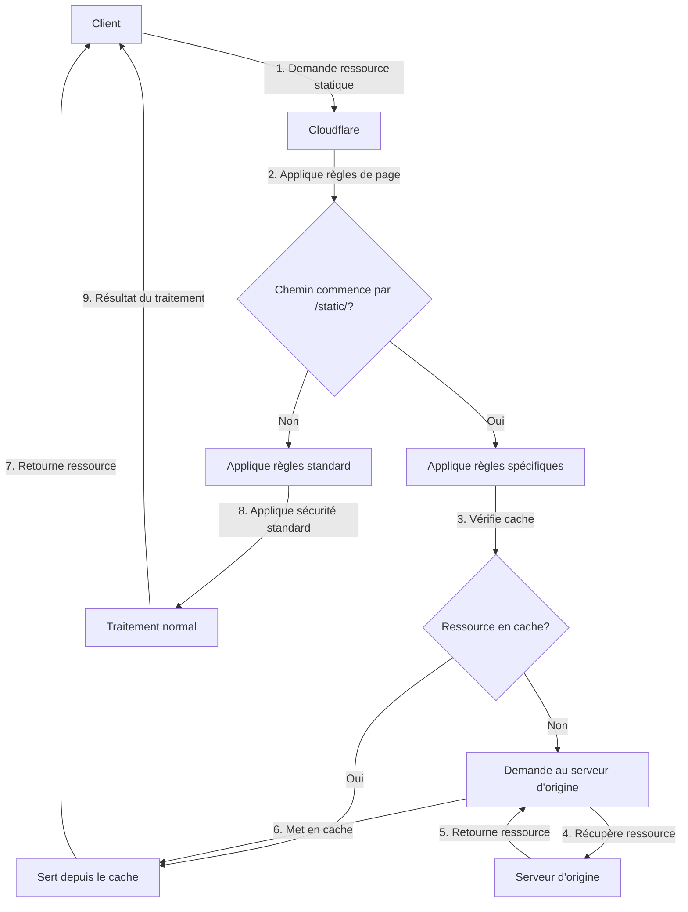

# Design Document

## Overview

Ce document présente la conception d'une solution pour configurer Cloudflare afin d'autoriser les requêtes vers les ressources statiques sous le chemin `/static/*`. La solution vise à résoudre les problèmes de blocage des ressources statiques par Cloudflare tout en maintenant un niveau de sécurité approprié pour le reste de l'application.

La solution repose sur la création de règles spécifiques dans Cloudflare qui permettent d'exempter les chemins `/static/*` des vérifications de sécurité les plus strictes, tout en optimisant la mise en cache de ces ressources pour améliorer les performances.

## Architecture

La configuration de Cloudflare s'intègre dans l'architecture existante du système de paiement Wave et se compose des éléments suivants :

1. **Règles de page (Page Rules)** : Des règles spécifiques pour les chemins `/static/*` qui définissent des paramètres de sécurité et de cache.
2. **Règles de pare-feu (Firewall Rules)** : Des règles qui permettent explicitement les requêtes vers les chemins `/static/*`.
3. **Configuration de cache** : Des paramètres optimisés pour la mise en cache des ressources statiques.

### Diagramme d'architecture



## Components and Interfaces

### Règles de page (Page Rules)

Les règles de page sont configurées dans l'interface Cloudflare et définissent des comportements spécifiques pour certains modèles d'URL.

**Configuration pour `/static/*`:**

- **URL Pattern**: `*longrich.online/static/*`
- **Settings**:
  - **Security Level**: Essentially Off
  - **Cache Level**: Cache Everything
  - **Edge Cache TTL**: 1 month
  - **Browser Cache TTL**: 1 month
  - **Always Online**: Off
  - **Disable Apps**: On
  - **Disable Performance**: Off
  - **Disable Security**: Off
  - **Disable Railgun**: On

### Règles de pare-feu (Firewall Rules)

Les règles de pare-feu sont configurées dans l'interface Cloudflare et définissent des actions spécifiques pour certains types de requêtes.

**Configuration pour `/static/*`:**

- **Name**: Allow Static Resources
- **Expression**: `(http.request.uri.path contains "/static/")`
- **Action**: Allow
- **Priority**: 1 (high priority)

### Configuration de cache

La configuration de cache est définie dans les règles de page et peut être complétée par des en-têtes HTTP appropriés.

**En-têtes recommandés pour les ressources statiques:**

```
Cache-Control: public, max-age=2592000
Expires: <date 30 days in the future>
```

## Data Models

N/A - Cette conception se concentre sur la configuration de Cloudflare plutôt que sur des modèles de données spécifiques.

## Error Handling

La configuration de Cloudflare doit prendre en compte les scénarios d'erreur suivants :

1. **Ressource non trouvée (404)** : Cloudflare doit transmettre l'erreur 404 au client sans interférer.
2. **Erreur serveur (5xx)** : Cloudflare peut être configuré pour servir une version mise en cache si disponible.
3. **Attaque DDoS** : Les règles de sécurité standard de Cloudflare doivent rester actives pour les autres chemins.

## Testing Strategy

La stratégie de test pour cette configuration comprend :

1. **Tests manuels** : Vérification manuelle que les ressources statiques sont correctement servies après la configuration.
2. **Tests automatisés** : Scripts qui vérifient l'accessibilité des ressources statiques.
3. **Tests de performance** : Mesure des temps de chargement avant et après la configuration.
4. **Tests de sécurité** : Vérification que la configuration n'introduit pas de vulnérabilités.

### Cas de test spécifiques

1. **Test d'accès aux ressources statiques** : Vérifier que les ressources sous `/static/*` sont accessibles.
2. **Test de mise en cache** : Vérifier que les ressources sont correctement mises en cache.
3. **Test de sécurité** : Vérifier que les autres chemins restent protégés par les règles de sécurité standard.
4. **Test de performance** : Mesurer les temps de chargement des ressources statiques.

### Procédure de vérification

1. Accéder à une page qui charge des ressources statiques depuis `/static/*`
2. Vérifier dans les outils de développement du navigateur que les ressources sont chargées avec un code 200
3. Vérifier que les en-têtes de cache sont correctement définis
4. Recharger la page et vérifier que les ressources sont servies depuis le cache (304 Not Modified ou directement depuis le cache du navigateur)
5. Vérifier que les autres fonctionnalités du site fonctionnent normalement