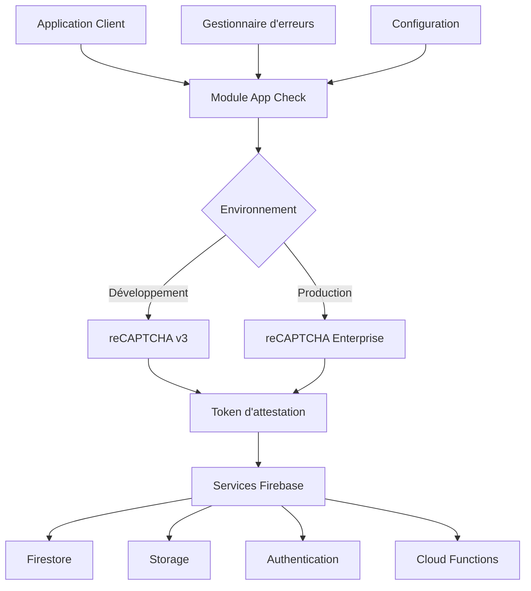

# Design Document: Firebase App Check Integration

## Overview

Ce document présente la conception détaillée pour l'intégration de Firebase App Check dans l'application e-commerce existante. App Check est un service de sécurité qui protège les ressources Firebase contre les accès non autorisés en vérifiant que les requêtes proviennent bien de l'application authentique.

L'intégration sera réalisée de manière à être transparente pour les utilisateurs légitimes tout en renforçant significativement la sécurité de l'application. Nous utiliserons différents fournisseurs d'attestation selon l'environnement (développement vs production) et mettrons à jour les règles de sécurité Firebase pour tirer pleinement parti d'App Check.

## Architecture

### Composants principaux

1. **Module App Check** : Responsable de l'initialisation et de la gestion d'App Check
2. **Fournisseurs d'attestation** : reCAPTCHA v3 (développement) et reCAPTCHA Enterprise (production)
3. **Gestionnaire d'erreurs** : Pour gérer les erreurs liées à App Check
4. **Configuration d'environnement** : Variables d'environnement pour les clés reCAPTCHA
5. **Règles de sécurité Firebase** : Mises à jour pour vérifier les tokens App Check

### Diagramme d'architecture



## Components et Interfaces

### 1. Module AppCheck (`src/config/appCheck.ts`)

Ce module sera responsable de l'initialisation et de la configuration d'App Check.

```typescript
// Interface pour la configuration App Check
export interface AppCheckConfig {
  isDebug: boolean;
  recaptchaSiteKey: string;
  recaptchaEnterpriseKey?: string;
  autoRefresh: boolean;
}

// Interface pour le résultat de l'initialisation
export interface AppCheckInitResult {
  success: boolean;
  appCheck?: AppCheck;
  error?: Error;
}

// Fonction d'initialisation
export function initializeAppCheck(app: FirebaseApp, config: AppCheckConfig): AppCheckInitResult;

// Fonction pour vérifier si App Check est disponible
export function isAppCheckAvailable(): boolean;

// Fonction pour obtenir le statut actuel d'App Check
export function getAppCheckStatus(): AppCheckStatus;
```

### 2. Gestionnaire d'erreurs (`src/utils/appCheckErrorHandler.ts`)

Ce module gérera les erreurs spécifiques à App Check.

```typescript
// Types d'erreurs App Check
export enum AppCheckErrorType {
  INITIALIZATION_FAILED,
  TOKEN_REFRESH_FAILED,
  RECAPTCHA_ERROR,
  NETWORK_ERROR,
  QUOTA_EXCEEDED,
  UNKNOWN
}

// Interface pour les erreurs App Check
export interface AppCheckError {
  type: AppCheckErrorType;
  message: string;
  originalError?: Error;
  timestamp: Date;
}

// Fonction pour gérer les erreurs App Check
export function handleAppCheckError(error: AppCheckError): void;

// Fonction pour enregistrer les erreurs App Check
export function logAppCheckError(error: AppCheckError): void;
```

### 3. Configuration d'environnement

Nous ajouterons de nouvelles variables d'environnement pour les clés reCAPTCHA.

```
# Fichier .env.example
# Ajout des variables pour App Check
VITE_FIREBASE_RECAPTCHA_SITE_KEY=your-recaptcha-v3-site-key
VITE_FIREBASE_RECAPTCHA_ENTERPRISE_KEY=your-recaptcha-enterprise-key
VITE_FIREBASE_APP_CHECK_DEBUG_TOKEN=optional-debug-token-for-development
```

## Data Models

### 1. Configuration App Check

```typescript
interface AppCheckConfig {
  isDebug: boolean;
  recaptchaSiteKey: string;
  recaptchaEnterpriseKey?: string;
  autoRefresh: boolean;
}
```

### 2. Statut App Check

```typescript
enum AppCheckStatus {
  NOT_INITIALIZED,
  INITIALIZING,
  ACTIVE,
  ERROR,
  DISABLED
}

interface AppCheckStatusInfo {
  status: AppCheckStatus;
  lastTokenRefresh?: Date;
  error?: AppCheckError;
}
```

### 3. Métriques App Check

```typescript
interface AppCheckMetrics {
  tokenRefreshCount: number;
  tokenRefreshFailures: number;
  lastSuccessfulRefresh?: Date;
  errors: AppCheckError[];
}
```

## Error Handling

### Stratégie de gestion des erreurs

1. **Erreurs d'initialisation** :
   - Tentatives de réinitialisation (jusqu'à 3 fois)
   - Fallback vers un mode dégradé si l'initialisation échoue
   

2. **Erreurs de rafraîchissement de token** :
   - Tentatives automatiques avec backoff exponentiel
   

3. **Erreurs reCAPTCHA** :
   - Tentative avec un fournisseur alternatif si disponible
   - Message d'erreur utilisateur si nécessaire

4. **Erreurs réseau** :
   - Mise en cache des tokens valides pour utilisation hors ligne
   - Tentatives de reconnexion automatiques

### Codes d'erreur

```typescript
enum AppCheckErrorCode {
  INITIALIZATION_FAILED = 'app-check/initialization-failed',
  TOKEN_REFRESH_FAILED = 'app-check/token-refresh-failed',
  RECAPTCHA_ERROR = 'app-check/recaptcha-error',
  NETWORK_ERROR = 'app-check/network-error',
  QUOTA_EXCEEDED = 'app-check/quota-exceeded',
  UNKNOWN_ERROR = 'app-check/unknown-error'
}
```

## Testing Strategy

### Tests unitaires

1. **Tests du module AppCheck** :
   - Initialisation correcte dans différents environnements
   - Gestion des erreurs d'initialisation
   - Rafraîchissement des tokens

2. **Tests du gestionnaire d'erreurs** :
   - Traitement correct des différents types d'erreurs
   - Stratégies de retry

### Tests d'intégration

1. **Tests avec Firebase Emulator** :
   - Vérification que les règles de sécurité fonctionnent correctement avec App Check
   - Simulation de requêtes avec et sans tokens valides

2. **Tests de bout en bout** :
   - Vérification que l'application fonctionne correctement avec App Check activé
   - Tests de scénarios d'erreur (réseau, quota dépassé, etc.)

### Tests de sécurité

1. **Tests de pénétration** :
   - Tentatives de contournement d'App Check
   - Vérification que les requêtes non autorisées sont bien bloquées

## Mise à jour des règles de sécurité Firebase

### Firestore Rules

Nous mettrons à jour les règles Firestore existantes pour intégrer la vérification App Check :

```
rules_version = '2';
service cloud.firestore {
  match /databases/{database}/documents {
    // Fonction helper pour vérifier App Check
    function isAppCheckValid() {
      return request.auth.token.app_check_verified == true;
    }
    
    // Règles de base : authentification et App Check requis pour toute opération
    match /{document=**} {
      allow read, write: if false;
    }
    
    // Règles pour la collection users
    match /users/{userId} {
      // Un utilisateur peut lire et modifier son propre document avec App Check valide
      allow read, update: if request.auth != null && 
                           request.auth.uid == userId && 
                           isAppCheckValid();
      // Permettre la création initiale du document utilisateur lors de l'inscription
      allow create: if request.auth != null && 
                     request.auth.uid == userId && 
                     isAppCheckValid();
      // Seuls les administrateurs peuvent supprimer des utilisateurs
      allow delete: if request.auth != null && 
                     exists(/databases/$(database)/documents/users/$(request.auth.uid)) &&
                     get(/databases/$(database)/documents/users/$(request.auth.uid)).data.role == 'admin' &&
                     isAppCheckValid();
    }
    
    // Règles pour la collection access_logs
    match /access_logs/{logId} {
      // Tout utilisateur authentifié avec App Check valide peut créer et lire les logs
      allow read, create: if request.auth != null && isAppCheckValid();
      // Personne ne peut modifier ou supprimer les logs
      allow update, delete: if false;
    }
    
    // Règles pour les produits
    match /products/{productId} {
      // Lecture publique mais avec App Check valide
      allow read: if isAppCheckValid();
      // Écriture réservée aux administrateurs avec App Check valide
      allow write: if request.auth != null && 
                    exists(/databases/$(database)/documents/users/$(request.auth.uid)) &&
                    get(/databases/$(database)/documents/users/$(request.auth.uid)).data.role == 'admin' &&
                    isAppCheckValid();
    }
    
    // Règles pour les commandes
    match /orders/{orderId} {
      // Un utilisateur peut lire ses propres commandes avec App Check valide
      allow read: if request.auth != null && 
                   resource.data.userId == request.auth.uid && 
                   isAppCheckValid();
      // Un utilisateur peut créer une commande pour lui-même avec App Check valide
      allow create: if request.auth != null && 
                     request.resource.data.userId == request.auth.uid && 
                     isAppCheckValid();
      // Seuls les administrateurs peuvent mettre à jour ou supprimer des commandes avec App Check valide
      allow update, delete: if request.auth != null && 
                             exists(/databases/$(database)/documents/users/$(request.auth.uid)) &&
                             get(/databases/$(database)/documents/users/$(request.auth.uid)).data.role == 'admin' &&
                             isAppCheckValid();
    }
  }
}
```

### Storage Rules

Nous mettrons également à jour les règles Storage pour intégrer App Check :

```
rules_version = '2';
service firebase.storage {
  match /b/{bucket}/o {
    // Fonction helper pour vérifier App Check
    function isAppCheckValid() {
      return request.auth.token.app_check_verified == true;
    }
    
    match /{allPaths=**} {
      // Lecture publique mais avec App Check valide
      allow read: if isAppCheckValid();
      // Écriture réservée aux utilisateurs authentifiés avec App Check valide
      allow write: if request.auth != null && isAppCheckValid();
    }
  }
}
```

## Considérations de déploiement

### Déploiement progressif

1. **Phase 1 : Mode d'observation**
   - Activer App Check en mode observation (sans bloquer les requêtes)
   - Collecter des métriques sur les requêtes qui auraient été bloquées

2. **Phase 2 : Activation pour les services non critiques**
   - Activer App Check pour Storage et certaines collections Firestore
   - Surveiller les impacts sur les utilisateurs

3. **Phase 3 : Activation complète**
   - Activer App Check pour tous les services Firebase
   - Mettre à jour toutes les règles de sécurité

### Configuration des environnements

1. **Environnement de développement**
   - Utiliser reCAPTCHA v3 comme fournisseur
   - Activer le mode debug avec token de debug

2. **Environnement de test/staging**
   - Utiliser reCAPTCHA v3 ou Enterprise
   - Tester les règles de sécurité avec App Check

3. **Environnement de production**
   - Utiliser reCAPTCHA Enterprise comme fournisseur
   - Désactiver tous les modes debug

## Monitoring et Maintenance

### Métriques à surveiller

1. **Taux de requêtes bloquées** : Pourcentage de requêtes bloquées par App Check
2. **Latence d'attestation** : Temps nécessaire pour obtenir un token d'attestation
3. **Taux d'erreur** : Pourcentage d'erreurs lors de l'obtention de tokens
4. **Utilisation de quota** : Suivi de l'utilisation des quotas App Check

### Alertes

1. **Alerte de taux de blocage élevé** : Si un pourcentage anormalement élevé de requêtes est bloqué
2. **Alerte de latence** : Si la latence d'attestation dépasse un seuil défini
3. **Alerte de quota** : Si l'utilisation du quota approche de la limite

## Conclusion

L'intégration de Firebase App Check renforcera significativement la sécurité de l'application e-commerce en vérifiant que les requêtes proviennent bien de l'application authentique. Cette conception prévoit une implémentation progressive et robuste, avec des stratégies de gestion d'erreurs et un monitoring approprié pour minimiser l'impact sur l'expérience utilisateur tout en maximisant la protection contre les accès non autorisés.