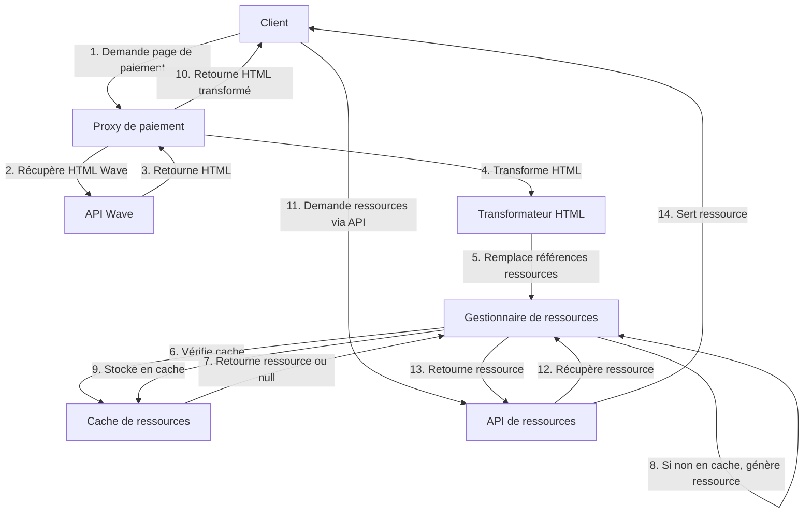

# Design Document

## Overview

Ce document présente la conception d'un système robuste pour gérer les ressources statiques dans le proxy de paiement Wave. Le système vise à résoudre les problèmes de chargement des ressources statiques (images, scripts, styles) qui sont actuellement bloquées par Cloudflare ou d'autres mécanismes de sécurité. La solution proposée repose sur trois approches complémentaires :

1. **Intégration directe des ressources** : Intégrer les ressources statiques directement dans le HTML sous forme de données base64 ou de SVG inline.
2. **API de ressources personnalisée** : Créer une API dédiée pour servir les ressources statiques sous un chemin qui n'est pas bloqué par Cloudflare.
3. **Système de cache** : Mettre en cache les ressources fréquemment utilisées pour améliorer les performances.

## Architecture

Le système s'intègre dans l'architecture existante du proxy de paiement Wave et se compose des composants suivants :

1. **Gestionnaire de ressources** : Un module qui gère les ressources statiques, les stocke et les sert via l'API.
2. **Transformateur HTML** : Un module qui modifie le HTML de la page Wave pour remplacer les références aux ressources externes par des versions intégrées ou des références à l'API de ressources.
3. **Cache de ressources** : Un système de cache qui stocke les ressources fréquemment utilisées pour améliorer les performances.
4. **API de ressources** : Une API RESTful qui sert les ressources statiques sous un chemin qui n'est pas bloqué par Cloudflare.

### Diagramme d'architecture



## Components and Interfaces

### Gestionnaire de ressources

Le gestionnaire de ressources est responsable de la gestion des ressources statiques. Il fournit les fonctionnalités suivantes :

- Stockage des ressources personnalisées
- Génération de ressources de remplacement
- Récupération des ressources depuis le cache
- Stockage des ressources dans le cache

```typescript
interface ResourceManager {
  // Récupère une ressource par son nom
  getResource(name: string): Promise<Resource>;
  
  // Vérifie si une ressource existe
  hasResource(name: string): boolean;
  
  // Ajoute une ressource personnalisée
  addResource(name: string, content: string, contentType: string): void;
  
  // Génère une ressource de remplacement
  generateFallbackResource(name: string): Resource;
}

interface Resource {
  content: string | Buffer;
  contentType: string;
  cacheControl: string;
}
```

### Transformateur HTML

Le transformateur HTML est responsable de la modification du HTML de la page Wave pour remplacer les références aux ressources externes par des versions intégrées ou des références à l'API de ressources.

```typescript
interface HtmlTransformer {
  // Transforme le HTML
  transform(html: string, baseUrl: string): string;
  
  // Remplace les références aux ressources externes
  replaceResourceReferences(html: string, baseUrl: string): string;
  
  // Intègre les ressources directement dans le HTML
  inlineResources(html: string): string;
}
```

### Cache de ressources

Le cache de ressources est responsable du stockage des ressources fréquemment utilisées pour améliorer les performances.

```typescript
interface ResourceCache {
  // Récupère une ressource du cache
  get(key: string): Resource | null;
  
  // Stocke une ressource dans le cache
  set(key: string, resource: Resource, ttl?: number): void;
  
  // Vérifie si une ressource est en cache
  has(key: string): boolean;
  
  // Supprime une ressource du cache
  delete(key: string): void;
  
  // Vide le cache
  clear(): void;
}
```

### API de ressources

L'API de ressources est responsable de servir les ressources statiques sous un chemin qui n'est pas bloqué par Cloudflare.

```typescript
interface ResourceApi {
  // Initialise l'API
  init(app: Express): void;
  
  // Gère les requêtes GET pour les ressources
  handleGetResource(req: Request, res: Response): Promise<void>;
}
```

## Data Models

### Resource

Le modèle de données pour une ressource statique.

```typescript
interface Resource {
  // Contenu de la ressource (chaîne pour texte, Buffer pour binaire)
  content: string | Buffer;
  
  // Type MIME de la ressource
  contentType: string;
  
  // En-tête Cache-Control
  cacheControl: string;
  
  // Date de création
  createdAt: Date;
  
  // Date de dernière modification
  updatedAt: Date;
  
  // Taille en octets
  size: number;
}
```

### ResourceMap

Une map qui associe les noms de ressources à leurs versions personnalisées.

```typescript
type ResourceMap = Map<string, Resource>;
```

## Error Handling

Le système gère les erreurs de la manière suivante :

1. **Ressource non trouvée** : Si une ressource n'est pas trouvée, le système génère une ressource de remplacement appropriée.
2. **Erreur de transformation** : Si une erreur se produit lors de la transformation du HTML, le système log l'erreur et continue avec le HTML original.
3. **Erreur de cache** : Si une erreur se produit lors de l'accès au cache, le système log l'erreur et continue sans utiliser le cache.
4. **Erreur d'API** : Si une erreur se produit lors du traitement d'une requête API, le système renvoie une réponse d'erreur appropriée avec un code d'état HTTP.

## Testing Strategy

La stratégie de test pour ce système comprend :

1. **Tests unitaires** : Tests des composants individuels (gestionnaire de ressources, transformateur HTML, cache de ressources, API de ressources).
2. **Tests d'intégration** : Tests de l'interaction entre les composants.
3. **Tests de bout en bout** : Tests du système complet dans un environnement similaire à la production.
4. **Tests de performance** : Tests pour vérifier que le système peut gérer un grand nombre de requêtes simultanées.
5. **Tests de sécurité** : Tests pour vérifier que le système ne présente pas de vulnérabilités de sécurité.

### Cas de test spécifiques

1. **Test de remplacement d'image SVG** : Vérifier que les images SVG sont correctement remplacées par des versions intégrées.
2. **Test de remplacement d'image PNG/JPG** : Vérifier que les images PNG/JPG sont correctement remplacées par des versions intégrées.
3. **Test de génération de ressource de remplacement** : Vérifier que le système génère correctement des ressources de remplacement pour les ressources non trouvées.
4. **Test de cache** : Vérifier que le système utilise correctement le cache pour améliorer les performances.
5. **Test de sécurité** : Vérifier que le système ne présente pas de vulnérabilités de sécurité (XSS, injection, etc.).